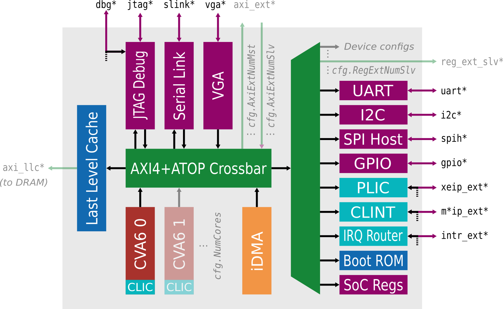

# Yosys User Group #5 - Examples &amp; Presentation
This repository contains examples to show of some of the [PULP platform](https://www.pulp-platform.org/) tools, specifically:

- [Bender](https://github.com/pulp-platform/bender): Dependency manager for hardware design projects
- [Morty](https://github.com/pulp-platform/morty): SystemVerilog pickler, (reads in many SystemVerilog files and combines them into one file)
- [SVase](https://github.com/pulp-platform/svase): SystemVerilog pre-elaboration tool (simplifies SystemVerilog constructs)

## Examples

### SVase

There are 3 examples showing of various SVase passes

- parameter propagation
- generate unrolling
- constant function resolving

### Cheshire Flow

The most exciting example combines the above mentioned tools together with [SV2V](https://github.com/zachjs/sv2v) (SystemVerilog to Verilog converter).

It shows how you can use the PULP System-on-Chip platform [Cheshire](https://github.com/pulp-platform/cheshire) to configure cores, peripherals and so on and then bring it to a form where it can be read into [Yosys](https://github.com/YosysHQ/yosys), the open-source synthesis tool.

Here you can see an architectural drawing of Cheshire. The grayed-out elements have not been configured in this example flow.

**Important**: Here we omit technology-dependent files, especially SRAM macros. If you want to use Cheshire, you will likely also want to map the SRAMs to something useful.
An example of a fully functional design using Cheshire are [Iguana and Basilisk](https://github.com/pulp-platform/iguana)
